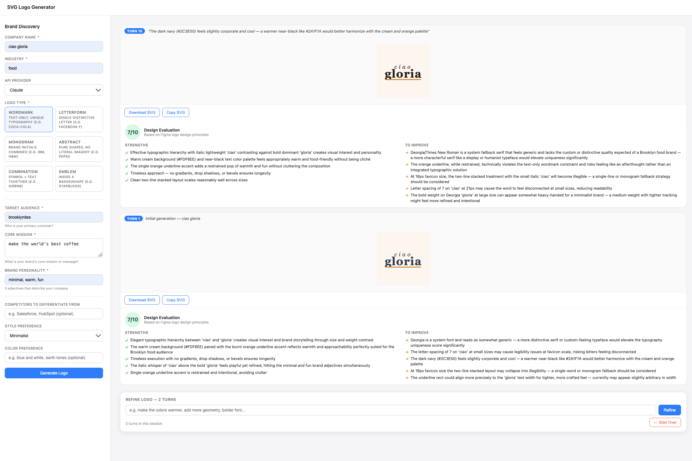

# SVG Logo Generator

An agentic logo design tool that uses Claude or GPT-4o to generate, validate, and evaluate SVG logos from a brand brief.



## How it works

Each generation runs a multi-step agent loop:

1. **Get design inspiration** — fetches type-specific patterns and industry conventions
2. **Get color palette** — selects industry-appropriate hex colors matched to the requested style
3. **Generate SVG** — produces a self-contained SVG logo matching the requested type
4. **Validate** — runs structural rule checks (viewBox, element count, color count, type-specific constraints)
5. **Evaluate** — scores the logo 1–10 against universal and type-specific design criteria; if score < 7, revises once
6. **Return** — sends the final SVG + evaluation to the frontend

Sessions persist for 30 minutes, allowing iterative refinement via natural language instructions.

## Logo types

| Type | Description |
|------|-------------|
| Wordmark | Text only — typography is the entire logo |
| Letterform | Single dominant letter with a distinctive treatment |
| Monogram | 2–3 initials in a tight, balanced composition |
| Abstract | Pure geometric shapes, no text |
| Combination | Symbol/icon + text wordmark |
| Emblem | All elements enclosed within an outer containing shape |

## Setup

```bash
npm install
cp .env.example .env
# Add your API key(s) to .env
npm run dev
```

Open `http://localhost:3000`.

## Environment variables

| Variable | Default | Description |
|----------|---------|-------------|
| `PORT` | `3000` | Server port |
| `AI_PROVIDER` | `claude` | Default provider (`claude` or `openai`) |
| `ANTHROPIC_API_KEY` | — | Required for Claude |
| `CLAUDE_MODEL` | `claude-sonnet-4-6` | Claude model ID |
| `OPENAI_API_KEY` | — | Required for OpenAI |
| `OPENAI_MODEL` | `gpt-4o` | OpenAI model ID |

## API

### `POST /api/generate`

Generate a new logo from a brand brief. Creates a session for subsequent refinement.

**Body**

```json
{
  "companyName": "Acme Corp",
  "industry": "Technology",
  "logoType": "wordmark",
  "targetAudience": "Enterprise CTOs aged 35–55",
  "coreMission": "Making data pipelines simple for non-technical teams",
  "brandAdjectives": "bold, trustworthy, modern",
  "competitors": "Salesforce, HubSpot",
  "style": "minimalist",
  "colors": "blue and white",
  "provider": "claude"
}
```

Required: `companyName`, `industry`, `logoType`, `targetAudience`, `coreMission`, `brandAdjectives`.

**Response**

```json
{
  "sessionId": "sess_...",
  "svg": "<svg ...>...</svg>",
  "turnCount": 1,
  "evaluation": {
    "score": 8,
    "strengths": ["..."],
    "improvements": ["..."],
    "rulePassed": true,
    "ruleIssues": []
  }
}
```

### `POST /api/refine`

Refine the current logo with a natural language instruction.

**Body**

```json
{
  "sessionId": "sess_...",
  "instruction": "Make the colors warmer and the font bolder"
}
```

**Response** — same shape as `/api/generate`.

### `DELETE /api/session/:sessionId`

Delete a session explicitly.

### `GET /api/health`

Returns provider availability.

## Project structure

```
src/
  server.ts          # Express entry point
  routes/logo.ts     # /api/generate, /api/refine, /api/session, /api/health
  services/
    agent.ts         # Agent loop, generateLogo, refineLogo, summarizeOldHistory
    tools.ts         # Tool implementations: validate_svg, generate_color_palette,
                     #   get_design_inspiration, evaluate_logo
    providers.ts     # ClaudeProvider and OpenAIProvider adapters
  types/index.ts     # Shared TypeScript types
  utils/svgParser.ts # SVG extraction from model responses
public/
  index.html         # Single-file frontend (no build step)
```

## Design tradeoffs

**Two-stage evaluation over end-to-end model judgment**
Validation is split into a fast rule-based pass (element count, color count, structural constraints by logo type) followed by a model-based critic. The rule pass catches structural errors cheaply without a model call; the critic handles aesthetics and brand fit that rules can't express. The cost is latency — every generation makes at least one extra API call for evaluation, and a revision adds another.

**One revision cap**
The agent is allowed one self-correction cycle if the score is below 7. This prevents runaway token spend at the expense of quality: a logo that still scores low after one revision is returned as-is. A higher cap would increase quality but multiply API cost and latency unpredictably.

**Hardcoded color palettes and inspiration data**
`COLOR_PALETTES` and `DESIGN_INSPIRATION` are static lookup tables keyed by industry and style. This makes palette selection deterministic, cheap, and testable, and grounds the model in specific hex values rather than letting it invent colors freely. The tradeoff is reduced creativity — unusual industries or style combinations fall back to generic defaults.

**Forced square viewBox (200×200)**
All logos are constrained to a square viewport. This simplifies rendering and consistent previewing in the UI but is a poor fit for wordmarks, which typically benefit from a wider aspect ratio. The evaluation critic flags this repeatedly — the constraint was chosen for UI simplicity over typographic quality.

**No external fonts**
SVGs must be fully self-contained with inline styles and no `@font-face` or external `href` references. This makes logos portable and renderable anywhere without network dependencies. The tradeoff is that only system fonts are available, which the evaluator consistently penalizes as generic; custom typography is the most-cited weakness in generated logos.

**In-memory session store**
Sessions live in a `Map` with a 30-minute TTL pruned on each request. This requires no database and keeps the server stateless from an infrastructure standpoint, but sessions are lost on server restart and the design doesn't scale horizontally across multiple processes.

**History summarization without a model call**
When conversation history exceeds 20 messages, old turns are compressed by concatenating truncated user instruction strings rather than calling the model to summarize. This is free and synchronous but discards assistant responses and tool call/result pairs from old turns, which can cause the model to lose context about prior design decisions.

**Prompt caching is a stub**
`applyPromptCaching` in [src/services/agent.ts](src/services/agent.ts) exists as a hook but does not add `cache_control` markers. Refinement sessions with long histories re-send the full transcript uncached on every turn, incurring full input token costs. The function is a placeholder for adding Anthropic cache breakpoints without restructuring the call site.

## Scripts

| Command | Description |
|---------|-------------|
| `npm run dev` | Run with hot reload via `tsx watch` |
| `npm start` | Run without hot reload |
| `npm run build` | Compile TypeScript to `dist/` |
| `npm run serve` | Run compiled output from `dist/` |
